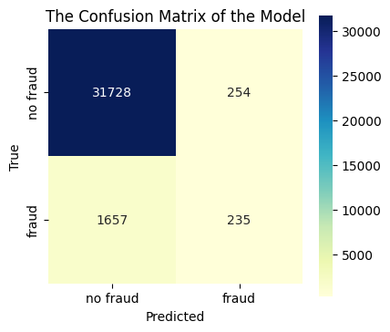

# Detection of fraude Electricity and Gas consumption for Société tunisienne de l'électricité et du gaz (STEG) 

 Fraud detection in electricity and gas consumption powered by machine learning

## Results summary
### Model summary


### The best model: performance
The best model is an XGBoost which consideres all engineered features 

|ROC curve| Confusion matrix|
|---|---|
|||

```
Recall: 0.34 Precision: 0.59 ROC AUC: 0.9 F-beta: 0.58

                Classification Report:
--------------------------------------------------
              precision    recall  f1-score   support

         0.0       0.96      0.99      0.97     95945
         1.0       0.59      0.34      0.43      5674

    accuracy                           0.95    101619
   macro avg       0.77      0.66      0.70    101619
weighted avg       0.94      0.95      0.94    101619
```
## Project Workflow

### Selection of performance metric based on the ML problem

- F1 is the metric of choice as a balance between precision and recall with the weight on recall. The model should detect as many frauds as possible by keeping the number of false alerts low.

### Hypotheses generation during Exploratory Data Analysis (link to the presentation here?)

1) Households in regions where fraud occurs more frequently than average are more likely to commit fraud themselves (check from the slide of Katja and correct)

2) Households with large variations in energy or gas consumption are more likely to commit fraud

## Data source

- Data are retrieved from a Zindi competition (source: https://zindi.africa/competitions/fraud-detection-in-electricity-and-gas-consumption-challenge/data)

- One file named "train.zip", containing two files: i) one contains client data (named "train_client.csv"); ii) one contains billing history from 2005 to 2019 (named "train_invoice.csv").

## Data description
<details>
<summary>Click to unfold</summary>
<p>

### Client dataset

| Feature name | Description |
| --- | ----------- |
| Client_id | Unique identifier for client |
| District | District number associated to the location of a client |
| Client_catg | Class the client belongs to; different class groups: **11, 12, 51** |
| Region | Region number associated to the location of a client|
| Creation_date | Date when a client became customer of STEG |
| Target | Category indicating fraudolent client when is equal to **1** and no fraudolent client when is equal to **0** |


### Invoice dataset 

| Feature name | Description |
| --- | ----------- |
| Client_id | Unique identifier for client |
| Invoice_date | Date of issue of the invoice relating to a given quarter due date for a client |
| Tarif_type | Type of way a client is charged for its electricity and gas copnsumption by the company STEG; each type is associated to a unique number|
| Counter_number | Serial number identifing the counter materialized by a series of numbers written on the counting device and unique for each client|
| Counter_statue | Working status of the device measuring the amount of energy consumed by a client, ranging from 1 to 5 (check together the values in that column?)|
| Counter_code | Registration number identifing the device made up of three digits located within the serial number of the meter |
| Counter_coefficient | Coefficient used to convert the raw meter readings from the meter into actual consumption values |
| Consommation_level_1 | Consumption level 1: it is less than 2.400 kwh per year corresponding to the cost of 181 millimes per kwh (source: https://kapitalis.com/tunisie/2022/05/12/tunisie-les-nouveaux-tarifs-de-la-steg/) |
| Consommation_level_2 | Consumption level 2: it is between 2.401 and 3.600 kwh per year corresponding to the cost of 223 millimes per kwh (source: https://kapitalis.com/tunisie/2022/05/12/tunisie-les-nouveaux-tarifs-de-la-steg/) |
| Consommation_level_3 | Consumpution level 3: it is between 3.601 et 6.000 kwh per year corrersponding to the of 338 millimes per kwh (source: https://kapitalis.com/tunisie/2022/05/12/tunisie-les-nouveaux-tarifs-de-la-steg/) |
| Consommation_level_4 | Consumption level 4: it exceeds 6.000 kWh per year corresponding to the cost of 419 millimes per kwh. https://kapitalis.com/tunisie/2022/05/12/tunisie-les-nouveaux-tarifs-de-la-steg/ |
| Old_index | Old counter meter reading |
| New_index | New counter meter reading |
| Months_number | Number of the month (where the meter reading was taken?); |
| Counter_type | Type of device measuring the amount of energy consumed; ELEC = measuring electricity consumption; GAZ = measuring gas consumption |

</p>
</div>

</details>

--- 
# Set up


### **`macOS`** type the following commands : 

- For installing the virtual environment you can either use the [Makefile](Makefile) and run `make setup` or install it manually with the following commands:

     ```BASH
    make setup
    ```
    After that active your environment by following commands:
    ```BASH
    source .venv/bin/activate
    ```
Or ....
- Install the virtual environment and the required packages by following commands:

    ```BASH
    pyenv local 3.11.3
    python -m venv .venv
    source .venv/bin/activate
    pip install --upgrade pip
    pip install -r requirements.txt
    ```
    
### **`WindowsOS`** type the following commands :

- Install the virtual environment and the required packages by following commands.

   For `PowerShell` CLI :

    ```PowerShell
    pyenv local 3.11.3
    python -m venv .venv
    .venv\Scripts\Activate.ps1
    pip install --upgrade pip
    pip install -r requirements.txt
    ```

    For `Git-bash` CLI :
  
    ```BASH
    pyenv local 3.11.3
    python -m venv .venv
    source .venv/Scripts/activate
    pip install --upgrade pip
    pip install -r requirements.txt
    ```

    **`Note:`**
    If you encounter an error when trying to run `pip install --upgrade pip`, try using the following command:
    ```Bash
    python.exe -m pip install --upgrade pip
    ```


   
## Usage

In order to train the model and store test data in the data folder and the model in models run:

**`Note`**: Make sure your environment is activated.

```bash
python example_files/train.py  
```

In order to test that predict works on a test set you created run:

```bash
python example_files/predict.py models/linear_regression_model.sav data/X_test.csv data/y_test.csv
```
